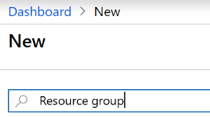
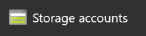

# Setting the Azure account and the environment

## Creating your Azure subscription

To create a free account, you can follow [the instructions at this link](http://gslb.ch/h17g-swisstechsummit19easteregg). If you already have an Azure account, you can also use this existing account here.

## Creating the Resource group

When you create an Azure application, multiple services are usually created. It's a good idea to group them in a Resource group so all these resources can easily be managed. For example, if you delete the Resource group, all the services that it contains will also be deleted.

You can find more information about [Resource groups here](http://gslb.ch/h307g-swisstechsummit19easteregg).

1. Navigate to [the Azure portal](http://portal.azure.com) and (if needed) log in using the credentials you used to create the account above.

2. In the Dashboard, on the top left, click on Create a Resource.

> In the Azure Marketplace area, you will see some popular services. For each Azure service listed here, you will find a `Learn more` link which leads to a series of "quick starts" articles.

3. In the box marked `Search the Marketplace`, enter the search term `Resource group`.

4. In the search results, select `Resource Group`. Then, at the bottom of the page, click on the `Create` button.

5. In the `Create a resource group` page, enter the following information:

- `Subscription`: Select the subscription that you want to use.

- `Resource group`: Enter the name of the new resource group. This must be unique within your subscription, for instance `techsummiteasteregg`.

- `Region`: Select the region in which your resource group should be placed. Typically you want to select a region close to your users to minimize latency.

6. Click on the `Review + Create` button. This will validate the information and then you can click on `Create`.

7. The creation of the resource group should go very fast. You can check the progress by clicking on the Notifications button on the top right. 

8. When the Resource group is ready, click on `Go to resource group`.

> Note: You can always find your resource group again by clicking on the Resource groups favorite on the left hand side.

## Creating the Storage account

In this section, we will create the storage account that will be used by the Azure Function later. Storage accounts are one of the most widely used services on Azure, and many Azure services require a storage account.

You can find more information [about Azure Storage accounts here](http://gslb.ch/h309g-swisstechsummit19easteregg). In this application, we will use the [Blob service](http://gslb.ch/h313g-swisstechsummit19easteregg). Blobs are Binary Large Objects, and can be just any file, such as images, videos, Office documents, PDF files, binary files, text files or really anything you want.

> Azure Storage accounts can also be used as [Files storage service](http://gslb.ch/h314g-swisstechsummit19easteregg), [NoSQL database](http://gslb.ch/h315g-swisstechsummit19easteregg) and [Queue service](http://gslb.ch/h316g-swisstechsummit19easteregg) for messaging.

1. Navigate to [the Azure portal](http://portal.azure.com) and (if needed) log in using yours credentials.

2. In the Dashboard, on the top left, click on Create a Resource.

3. Click on Storage account. 

4. Enter the following information to create the new Storage account.

- `Subscription`: Make sure to select the subscription that you have been using so far.
	
- `Resource group`: In the combo box, select the Resource group that you created earlier, for example `techsummiteasteregg`.
	
- `Storage account name`: Enter `techsummiteastereggstore`.

> Storage account names must be in lowercase without any dashes or other special characters.
    
- `Location`: Select a location close to your users, for instance `West Europe`.

- `Performance`: Select `Standard`. *Premium performance uses high performance SSDs which are more expensive. [More details here](http://gslb.ch/h308g-swisstechsummit19easteregg).*
	
- `Account kind`: Select `StorageV2`. *This is the version of the APIs that you will be using here. [More details here](http://gslb.ch/h309g-swisstechsummit19easteregg).*
    
- `Replication`: Select `Locally-redundant storage`. *This governs the way that data is replicated for backup and high availability. [More details here](http://gslb.ch/h310g-swisstechsummit19easteregg).*
	
- `Access tier`: Select `hot`. *Hot access means that the data will always be available fast. Cool access is less expensive but the data will not be available as fast. There is also an Archive access tier for blob containers. [More details here](http://gslb.ch/h311g-swisstechsummit19easteregg).*

5. Click `Review + Create` to trigger the validation of the information, and then the `Create` button. The creation of the Storage account will take a couple of minutes.

6. Once the creation of the Storage account is complete, click on `Go to resource`.

> You can always find the storage account by clicking on `Storage accounts` under Favorites, and then selecting your storage account (for example `techsummiteasteregg`) from the list.

7.  In the list of features for the storage account, scroll down to `Blob service` and click on `Blobs`.

8. On the right hand side, click on `+ Container` to create a new container in this blob storage.

9. Enter the name `tech-summit` for the new container and set the `Public access level` to `Blob (anonymous read access for blobs only)`.

9. Click on the `OK` button to trigger the creation of the blob container.

With the Azure Storage account created, we will now [create a Cognitive Service using the Face API](./01a-setting-up-cognitive.md) so that our pictures can be analyzed.