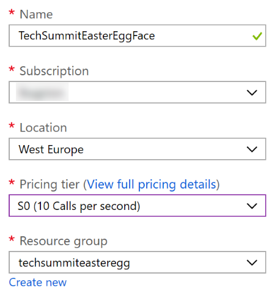
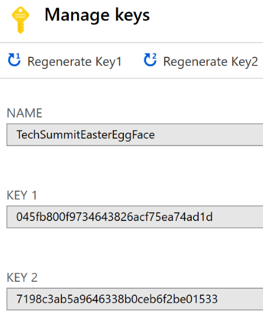

# Setting up the Cognitive Service

In order to analyze the picture, we will use a Cognitive Service. These are "pre-packed" Artificial Intelligence models created and optimized by Microsoft, and published as a series of APIs that any developer can call. Even though a basic understanding of AI is preferrable to work with these services, you won't need to dig deep for this example. The service is quite straightforward:

- You will submit a picture to the service.
- The service will analyze the picture and return some predictions regarding the person's emotions. Currently the service detects the following emotions. For every one of these, a value between 0 (0%) and 1 (100%) is returned in a JSON document.
    - anger
    - contempt
    - disgust
    - fear
    - happiness
    - neutral
    - sadness
    - surprise

> You can call the cognitive service directly using REST APIs. In this example however, we will rather use a Software Development Kit (SDK) which makes it a little more straightforward. Under the cover however, the SDK will call the REST APIs anyway. SDKs are available for .NET, Java, JavaScript and more.

In this document we will create the Cognitive Service in the Azure portal.

> You can also test some of the Cognitive Services directly online, [for example the Face API](http://gslb.ch/h317g-swisstechsummit19easteregg).

## Creating the service

1. Go to the [Azure Portal](http://portal.azure.com).

2. Click on `Create a resource`.

3. In the Search box, enter `Face API`.

4. In the list showing up in the Search result, select the `Face` service.

5. In the next dialog, enter the following information to configure the service:

- `Name`: Enter a name for your service, for example `TechSummitEasterEggFace`.

- `Subscription`: As always, select the subscription that you have been using throughout this example.

- `Location`: Enter the location closest to your user, for example `West Europe`.

- `Pricing tier`: You can use the free tier for this example. In the screenshot we used a tier named `S0` which allows up to 10 calls per second.

- `Resource group`: Select the same resource group that you have been using for the Storage account earlier. Having all the resources in the same resource group makes it easier to manage and delete them.

6. After the creation of the service is complete, click on `Go to resource`. If you missed that, you can always click on the Notification button in the Azure Portal's toolbar to open the notifications window and click on the new resource.

7. In the Cognitive service dashboard, click on the Overview and check the details. Later, you will need the endpoint value for the Functions application that you will be writing.

> IMPORTANT: The endpoint in the Overview tab might look like this: `https://westeurope.api.cognitive.microsoft.com/face/v1.0`. However for the Function we will need a value like `https://westeurope.api.cognitive.microsoft.com` without the `/face/v1.0`.

8. Further below, click on the Quick Start menu. You will see a section called Grab your keys. Click on the `Keys` link below that and copy the first key shown on the screen. Save this key for later.

With the Azure account created, and the Cognitive Service set up, we can now [install Visual Studio Code](./02-installing-tools.md), the tool we will use to implement the Azure Functions application handling the images.