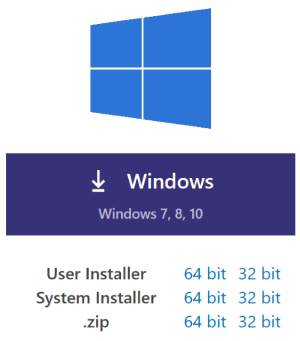

# Installing the tools

In this section, we will install Visual Studio Code and the Azure Functions extension.

Visual Studio Code is a cross-platform development environment that is very simple to install on Windows, Mac OS and Linux. It is also very powerful thanks to the usage of extensions that you can install for various tasks. In this document, we show you the instructions to install on Windows, but you can easily do the same on the other operating systems as well.

## Installing Visual Studio Code

1. Go to the [Visual Studio Code download page](http://gslb.ch/h209g-swisstechsummit19easteregg).

2. Download the correct version. You can select 32 or 64 bits.

3. Complete the setup and launch Visual Studio Code.

## Installing the rest of the tools

In order to develop Azure Functions from Visual Studio Code, you will need the following prerequisite:

- [Azure Functions Core Tools](https://docs.microsoft.com/en-us/azure/azure-functions/functions-run-local#v2) TODO Shorten
- [C# for Visual Studio Code](https://marketplace.visualstudio.com/items?itemName=ms-vscode.csharp)
- [.NET Core CLI Tools](https://docs.microsoft.com/dotnet/core/tools/?tabs=netcore2x) TODO shorten
- Azure Function extension for Visual Studio Code

For more information about how to install these tools, [you can check this page](https://docs.microsoft.com/en-us/azure/azure-functions/functions-create-first-function-vs-code).

TODO Shorten

Now we have the tools we need to create the Blob triggered and HTTP triggered Functions, and to publish them to Azure. [Let's start by implementing the Blob Triggered Function](./03a-blob-function.md)!

