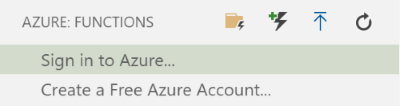
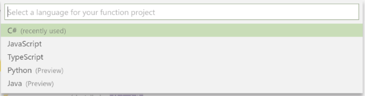
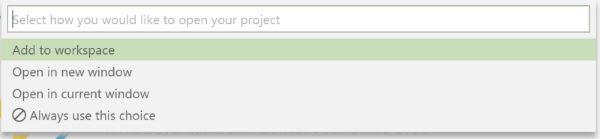
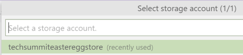
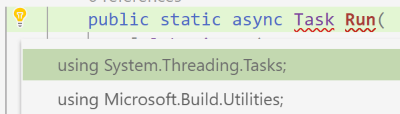
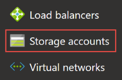
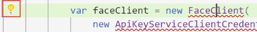

# Implementing the Blob Triggered Function and testing it locally

One of the best features of our development tools is that they allow you to develop and test the Azure Functions locally, before you deploy to Azure. This makes the development very convenient and fast. Here we will use Visual Studio Code but if you prefer you can also use [Visual Studio 2017](http://gslb.ch/h322g-swisstechsummit19easteregg) or [Visual Studio 2019](http://gslb.ch/h323g-swisstechsummit19easteregg) with the [Azure development workload](http://gslb.ch/h324g-swisstechsummit19easteregg) installed. 

> In this example, we will work directly with the Azure Storage account that you created and configured earlier. However for testing purposes, you can also work with the [Azure Storage Emulator](http://gslb.ch/h325g-swisstechsummit19easteregg) 

## Creating the Azure Functions project

1. Open Visual Studio Code and select the Azure button in the toolbar on the left.


> You might have to sign into Azure using the credentials that you also used before in the Azure portal.



2. Click on the `New project` button in the toolbar on the top left.


3. In the Explorer window, navigate to the folder that you want to create the project into. You can also create a new folder, for example named `techsummiteasteregg`.

4. Select the language you want to use for your Functions application. Here we will use C#.



5. Select how you want to open the new project, for example `Open in current window`.

> Note: Depending on your installation, it is possible that VS Code asks you already here which type of Function you want to create. In this case, click `Skip for now`.



At this point you will see the project files in the Explorer area. You could also open this project file in Visual Studio 2017 or 2019 on Windows if you prefer.


## Implementing and testing the Blob triggered Function

Now we can implement the Blob triggered Function, the first Function that we will write and test locally.

1. In the Visual Studio Code toolbar on the left, click on the Azure button.


2. In the Azure Functions toolbar on the top left, click on the New Function button.


3. Select the folder containing the application that you just created.


4. Select the `BlobTrigger` Function template.


5. Enter a name for the Function. Here we will call it `CheckPicture`.


6. Enter a namespace for your function. We will use `TechSummitEasterEgg`.


7. Select the `AzureWebJobsStorage` setting.


8. Enter a name for the blob container that will be observed. You must use the same name than we created before [in the Setup phase](./01-setting-up.md). Here we used `tech-summit`.


9. You should now see a notification in the bottom right corner telling you that you need to select a Storage account. Click on the `Select Storage Account` button.


12. In the list that opens at the top of VS Code, select the subscription that you have been using so far.


11. Then, select the Storage account we created earlier (here it's called `techsummiteastereggstore`)



> This setting will be copied to the `local.settings.json` file which is used during development. This will contain the information needed for the function to connect to the Blob container and observe it. In production, this information will be copied to the Azure Function settings.

At this point we are configured and ready to implement the first function, which will be the [Blob triggered function](./03a-blobfunction.md).

### Implementing the code

Now is the time to write some code!! [Note that you can see the finished code file here](https://github.com/Azure-Samples/TechSummit-Switzerland-Easter-Egg/blob/master/TechSummitEasterEgg/CheckPicture.cs).

First of all, we will connect to the Blob container and make sure that we can read from it, but also write the result to it. Later, we will enter the results of the Cognitive Service Face API into a text file saved in the storage account.

You should now see the empty Blob Triggered function in the Visual Studio Code editor. After reformatting, it should look like this:

``` cs
namespace TechSummitEasterEgg
{
    public static class CheckPicture
    {
        [FunctionName("CheckPicture")]
        public static void Run(
            [BlobTrigger(
                "tech-summit/{name}", 
                Connection = "AzureWebJobsStorage")]
            Stream myBlob, 
            string name, 
            ILogger log)
        {
            log.LogInformation($"C# Blob trigger function Processed blob\n Name:{name} \n Size: {myBlob.Length} Bytes");
        }
    }
}
```

The first parameter `myBlob` is the input blob, and will contain the picture that you will upload to the storage account.

The second parameter `name` is the name of the picture, passed to us by the Azure Function runtime.

The third parameter is a logger, which you can observe in the Console or online in the portal after the Function is published.

#### Writing the result

To write the result, we will use a simple method shown below. Simply add this method in the `CheckPicture` class, below the `Run` method.

``` cs
private static void WriteResult(Stream resultStream, string result)
{
    using (var writer = new StreamWriter(resultStream))
    {
        writer.Write(result);
    }
}
```

Then call this method from within the `Run` method, which now becomes:

```cs
[FunctionName("CheckPicture")]
public static async Task Run(
    [BlobTrigger(
        "tech-summit/{name}", 
        Connection = "AzureWebJobsStorage")]
    Stream myBlob, 
    string name, 
    ILogger log,
    [Blob("tech-summit-result/{name}.txt", FileAccess.Write)]
    Stream resultStream)
{
    log.LogInformation($"C# Blob trigger function Processed blob\n Name:{name} \n Size: {myBlob.Length} Bytes");

    WriteResult(resultStream, name);
}
```

Note how we added a 4th parameter `resultStream` and added an attribute to make it save itself directly to a Blob located into a new Blob container named `tech-summit-result`.

> We took the occasion to make this method asynchronous and to return a Task, which will make our life much easier later when we handle asynchronous calls. In order to add the Task namespace to the function, you can follow these steps:

1. Place the cursor inside the word `Task`.
2. On the left hand side, you should see a small lightbulb. Click on it.
3. Select the first entry in the drop down. This adds the instruction `using System.Threading.Tasks;` to the top of the file.


and then



#### Testing the blob trigger

In order to test the blob trigger, we will set a breakpoint in the code at the `log.LogInformation` line. Then select the menu `Debug/Start Debugging` in Visual Studio Code. You should see the Terminal window showing up, and some information about the Azure Functions runtime getting started. After a short wait, the function will be ready and waiting for your input.

To test the process, follow the steps:

1. Go to [the Azure Portal](http://portal.azure.com) and select Storage Accounts from the Favorites.



2. Select the Storage Account that you created earlier (the one that we named `techsummiteastereggstore` in this tutorial).

3. Under `Blob service`, select `Blobs`.

4. Select the blob container you created earlier (the one named `tech-summit`).

5. Press the Upload button.


6. In the `Upload blob` drawer, select a picture from your computer and upload it. After a short wait, you should see that your function has been triggered in Visual Studio Code. You can then run the code step by step with the `Debug/Step into` command (F11) and see how the `WriteResult` method is executed.

7. When the code is finished, in the Azure Portal, go back to `techsummiteastereggstore - Blobs` in the crumb bar on top of the portal window (your storage account's name might be different).

8. Press the `Refresh` button. You should now see a new blob container named `tech-summit-result`. Click on this blob container, and notice the presence of a blob named after the file that you just uploaded, with the `.txt` extension. This shows that the method call was successful.

#### Installing the Cognitive Service SDK

In order to call the [Cognitive service that we setup earlier](./01a-setting-up-cognitive.md), we are going to use an SDK which can be installed via the .NET package manager. Follow the steps:

1. In Visual Studio Code, select the menu `Terminal/New Terminal".


2. In the Terminal window, copy the following code and press enter:

```
dotnet add package Microsoft.Azure.CognitiveServices.Vision.Face --version 2.3.0-preview
```

> You can always find the latest version of the Cognitive Services Face SDK [on the Nuget site](https://www.nuget.org/packages/Microsoft.Azure.CognitiveServices.Vision.Face/2.3.0-preview).

At this point, the Cognitive Service Face SDK has been added to our project and we can now continue implementing the Function.

#### Calling the Face SDK

Now that the Cognitive service SDK for the Face API is installed, we can add code that will use it.

First we will add some constants. Copy the code below and paste it in the class, right after the declaration `public static class CheckPicture`.

> If you are not sure, you can always [check the full code here](https://github.com/Azure-Samples/TechSummit-Switzerland-Easter-Egg/blob/master/TechSummitEasterEgg/CheckPicture.cs).

```cs
// REPLACE CONSTANTS HERE ----------------------------------------------

// If you set this constant to True, we will tweet your success from 
// the Microsoft TechSummit account!!
private const bool PublishSuccessOnTwitter = true|false;

// Enter your Twitter name. 
// This name will be published to Twitter if PublishSuccessOnTwitter is set to true. 
private const string Twitter = "[YOUR TWITTER NAME]";

// Enter the key phrase that you copied from the disk's readme file.
private const string SecretKey = "[KEY PHRASE FROM THE DISK]";

// Enter the name of the storage account you created.
private const string StorageAccountName = "[STORAGE ACCOUNT NAME]";

// Enter the subscription key and the endpoint of the Face API cognitive service you created.
private const string FaceSubscriptionKey = "[COGNITIVE SERVICE KEY]";
private const string FaceEndpoint = "[COGNITIVE SERVICE ENDPOINT]";

// ------------------------------------------------------------------
```

In the code above, replace the constants with the values that you get from various locations:

- `PublishSuccessOnTwitter`: Set this value to `true` if you want the Microsoft Switzerland account to tweet a congratulatory message at your address if you succeed completing this application. If set to false, we will still value your efforts, but we won't tweet about it to preserve your privacy.

- `Twitter`: Enter your Twitter name here, without the @ character.

- `SecretKey`: Enter the Secret Key that you found on the floppy disk :)

- `StorageAccountName`: Enter the storage account name that you created earlier (for example `techsummiteastereggstore`).

- `FaceSubscriptionKey`: Enter the key to the Cognitive service that you created earlier. We showed you how to obtain this key in the [Cognitive service setup document](./01a-setting-up-cognitive.md#gettingkeys) under `Getting the key`.

- `FaceEndpoint`: Enter the endpoint of the Cognitive service. We taught you how to get this value from the Cognitive Service overview in the in the [Cognitive service setup document](./01a-setting-up-cognitive.md#gettingendpoint) under `Getting the endpoint`.

> Make sure to copy the endpoint URL without the `/face/v1.0`. The endpoint URL should look like `https://westeurope.api.cognitive.microsoft.com`.

Next we will add three more constants and one more attribute. Simply add this code below the constants that you added before.

```cs
private const string UrlBaseFunction = "https://lbswisstechsummit19.azurewebsites.net/api/check-id?code=Av6VBZfLgEJ6DO20av2YNTZeVXdPmrdHNU0YvoGprf1b4n0paGQAMw==";

private const string ContainerName = "tech-summit";
private const string ContainerResultName = "tech-summit-result";

private static readonly FaceAttributeType[] faceAttributes
    = { FaceAttributeType.Emotion };
```

- `UrlBaseFunction` is the URL of the verification Functions application that your code will call to check that your submission is valid.

- `ContainerName`: This is the name of the blob container that our code will observe.

- `ContainerResultName`: This is the name of the container where we will copy the result of the processing.

- `faceAttributes`: This attribute will be used to configure the Emotion API that we are sending your picture to.

Now that all the constants and attributes are defined, we will create and call the FaceClient that will analyze your picture with the power of Artificial Intelligence.

Copy the code below **into** the `Run` method, below the `log.LogInformation` line. You can **replace** the call to `WriteResult` with the following lines:

> Like before, after pasting the code, you will see quite a few errors represented by a "squiggly" red underline below certain identifiers. Most of the time, it's simple because a namespace is missing from the "using" section on top of the class. You can fix errors by putting cursor in the error, then clicking on lightbulb on the left handside. Simply click and select the correct namespace from the list. Most of the time, the namespace you need is the first of the list.



```cs
// Recognize the face emotion

string result;

log.LogInformation("Recognizing the emotion");

var faceClient = new FaceClient(
    new ApiKeyServiceClientCredentials(FaceSubscriptionKey),
    new DelegatingHandler[] { })
{
    Endpoint = FaceEndpoint
};

IList<DetectedFace> faceList = null;
Exception error = null;

try
{
    faceList
        = await faceClient.Face.DetectWithStreamAsync(
            myBlob,
            true,
            false,
            faceAttributes);
}
catch (Exception ex)
{
    log.LogError("There was an error", ex);
    error = ex;
}

if (error != null)
{
    result = "There was an error:\r\n"
        + error.Message;

    WriteResult(resultStream, result);
    return;
}
```

- First we are creating a new `FaceClient`. We need to pass the `FaceSubscriptionKey` that we defined before, as well as the `FaceEndpoint`.

- Then we prepare the code for some error handling. We will save a list of all the faces detected in the picture, as well as a potential error if there is one.

- In the `try` block, we call the `DetectWithStreamAsync` method. We pass the input stream, named `myBlob`, which contains the image. We also pass the `faceAttributes` used to parameterize the `FaceClient`.

- If there is an error, the caught exception will be saved in the `error` variable. In this case, we will save the error message to the output blob, and then return.

The next step is to inform the user in case the Cognitive service was unable to find any faces (or if there is more than one face) on the picture. Here too, we will save this information to the output blob and then return.

```cs
if (faceList == null
    || faceList.Count != 1)
{
    result = "No faces, or more than one face detected:";
    log.LogInformation(result);
    WriteResult(resultStream, result);
    return;
}
```

Next, we will inform the user in case a face was detected, but the emotion is not happy.

```cs
if (faceList[0].FaceAttributes.Emotion.Happiness < 0.5)
{
    result = "You should be happier than that!! Try again!!";
    log.LogInformation(result);
    WriteResult(resultStream, result);
    return;
}

log.LogInformation("You seem very happy, let's check further");
```

At this point, the picture has been successfully uploaded, analyzed and a smiling face has been found. Now is the time to save the results into the output blob. We will save a few pieces of information so the verification application can do its job and check the result. Add the following code to the `Run` method:

```cs
var parameters = new
{
    SecretKey,
    BlobUrl = $"https://{StorageAccountName}.blob.core.windows.net/{ContainerName}/{name}",
    TwitterName = Twitter,
    PublishSuccessOnTwitter,
    SubscriptionId = Environment.GetEnvironmentVariable("WEBSITE_OWNER_NAME"),
    HostName = Environment.GetEnvironmentVariable("WEBSITE_HOSTNAME")
};

var json = JsonConvert.SerializeObject(parameters);
```

As you can see, we create a new anonymous type here, and serialize it in JSON format. Next we will send this information to the verification Function with a POST request.

```cs
// Communicate with the base function

var client = new HttpClient();
var content = new StringContent(json);

log.LogInformation("Checking your submission...");

var response = await client.PostAsync(UrlBaseFunction, content);
```

- First we create a new `HttpClient`. This class is often used to communicate with REST APIs.
- Then we prepare the JSON content into a `StringContent` instance.
- Finally we `PostAsync` the JSON content to the Function. After processing, this will return a `response` that we will decode in the next code block. Note the usage of the `await` keyword for asynchronous processing.

```cs
// Check response

var responseStream = await response.Content.ReadAsStreamAsync();

using (var reader = new StreamReader(responseStream))
{
    result = reader.ReadToEnd();
}

if (response.StatusCode != HttpStatusCode.OK)
{
    result = $"Status code doesn't indicate success: {response.StatusCode}";
    log.LogInformation(result);
    WriteResult(resultStream, result);
    return;
}
```

- With the `response` object obtained from the verification Function, we obtain a Stream which we read using a `StreamReader`.
- The response (in clear text) is saved into the `result` variable.
- Next we check if the HTTP code returned by the verification Function is anything else than a success. The Function has the possibility to return various error codes in case something doesn't fit what it was expecting.

And finally the last step, if everything goes well we save the result into the output blob (with the help of the `WriteResult` method) and then we inform the user in the Console by using the `log` object.

```cs
// Write to the output blob

WriteResult(resultStream, result);

var resultUrl = $"https://{StorageAccountName}.blob.core.windows.net/{ContainerResultName}/{name}.txt";
log.LogInformation($"Success!! Check {resultUrl} for details.");
```

## Testing and checking the result

In order to check the result, we will again run the Function in debug mode, and submit various types of pictures.

1. Go to [the Azure Portal](http://portal.azure.com) and select Storage Accounts from the Favorites.


2. Select the Storage Account that you created earlier (the one that we named `techsummiteastereggstore` in this tutorial).

3. Under `Blob service`, select `Blobs`.

4. Select the blob container you created earlier (the one named `tech-summit`).

5. Press the Upload button.


6. In the `Upload blob` drawer, select a file from your computer and upload it. After a short wait, you should see that your function has been triggered in Visual Studio Code. You can then run the code step by step with the `Debug/Step into` command (F11) and see how the code is executed. Try the following scenarios:

    6.1. Upload a picture without any faces on it. The Cognitive service should return an empty `faceList`.

    6.2. Upload a picture with a sad face. The Cognitive service should return the corresponding result and save it in the output blob.

    6.3. Upload a picture with a smiling face. At this point, the verification Function should be called with the corresponding parameters but it will return an error message (saying that the submission is invalid because all fields are not filled), because your Functions were not published to Azure yet. At this point, you can tell that the test is successful.

7. When the code is done running, in the Azure Portal, you can always go back to `techsummiteastereggstore - Blobs` in the breadcrumb bar on top of the portal window (or what you named your storage account).

8. Press the `Refresh` button if needed. You should now see the blob container named `tech-summit-result`. Click on this blob container, and notice the presence of a blob named after the file that you just uploaded, with the `.txt` extension. This shows that the method call was successful.

9. Click on the corresponding txt file, and select `Edit Blob` from the portal. You should now see the content of the text file, and the corresponding error message(s).

Wow, that was a long process, but check this out, you have just implemented a Blob Triggered Function and called a Cognitive Service to recognize an emotion on the picture. This is pretty exciting stuff! Now we will add a new [HTTP Triggered Function](./03b-http-function.md) to the mix, just for verification purposes, and then we will be ready to publish everything to Azure!