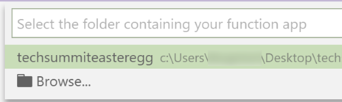
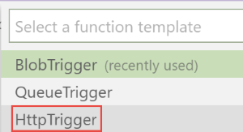
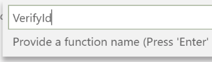
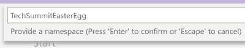

# Implementing the HTTP Triggered Function and testing it locally

At this point, we have the main Function of the application, which we developed earlier and which is triggered when a picture is uploaded to Blob storage. The second Function will be a lot easier to implement and test. All we need is a web browser, and we can test this function locally without accessing the Azure portal. 

1. In the Visual Studio Code toolbar on the left, click on the Azure button.


2. In the Azure Functions toolbar on the top left, click on the New Function button.


3. Select the folder containing the application that you just created.



4. Select the `HttpTrigger` function template.



5. Enter a name for the function. Here we will call it `VerifyId`.



6. Enter a namespace for your function. We will use the same namespace as for the Blob triggered Function: `TechSummitEasterEgg`.



7. Select `Anonymous` access rights. This just means that anyone can call this Function online when it is published.


## Implementing the code

At this point, the new Function is created in the same project as earlier. You should see code that (after reformatting) looks like this:

```cs
namespace TechSummitEasterEgg
{
    public static class VerifyId
    {
        [FunctionName("VerifyId")]
        public static async Task<IActionResult> Run(
            [HttpTrigger(
                AuthorizationLevel.Anonymous, 
                "get",
                "post",
                Route = null)]
            HttpRequest req,
            ILogger log)
        {
            log.LogInformation("C# HTTP trigger function processed a request.");

            // Some boilerplate code
        }
    }
}
```

> In the code above, I removed the boilerplate code that we won't be using anyway. 

Now we will modify the function signature to correspond to what we want to do. Change the code to look like this:

TODO Make synchronous

```cs
[FunctionName("VerifyId")]
public static async Task<IActionResult> Run(
    [HttpTrigger(
        AuthorizationLevel.Anonymous, 
        "get", 
        Route = "verify/id/{id}")]
    HttpRequest req,
    string id,
    ILogger log)
{
    log.LogInformation("C# HTTP trigger function processed a request.");

    if (!Environment.GetEnvironmentVariable("WEBSITE_OWNER_NAME").StartsWith(id))
    {
        return new BadRequestObjectResult("Subscription ID doesn't match");
    }

    return new OkObjectResult("All good");
}
```

- First, we removed the `post` option and only allow `get` for this Function.

- Then we changed the `Route` to be `verify/id/{id}`. This will be a part of the URL for the Function call. The first part `verify` is the name of the Function. Then we define one parameter named `id`. And finally we add a placeholder `{id}` which will be replaced by the caller.

- We added a parameter to the method, called `id`. This parameter will be extracted from the URL by the Azure Function runtime, using the `{id}` placeholder that was defined earlier.

- Inside the `Run` method, we also changed some code:

    - We check the `id` passed by the caller and match it against our own Subscription ID, retrieved by the `WEBSITE_OWNER_NAME` environment variable. If there is a mismatch, we return a `BadRequestObjectResult` to the caller, which will cause an HTTP error.

    - Finally if there is no mismatch, we return an `OkObjectResult` which will translate to an HTTP code 200, meaning that everything is fine.

For the verification application, calling this method checks that you did indeed publish the Azure Functions application to Azure and that the Subscription IDs match. We also make sure that the Subscription ID is unique. This is why you can only submit a smiling picture once, get your reward (the tweet from the Swiss Microsoft account) and then rest on your success :)

As the next step, we will now [publish the Functions application to Azure](./04-publishing.md), and then test the different parts of it.