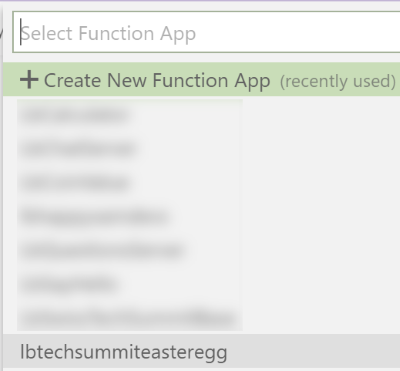

# Creating the Functions application and publishing your code

At this point, we are ready to publish our Functions application in Azure. First we will create a new Functions application using the Azure portal, and then we will push our code to the Cloud using Visual Studio Code.

> In a production application, you want to use a more stable way to push code to Azure, for example with an Azure DevOps pipeline. In this example, we will use the Publish functionality of Visual Studio Code.

1. Go to the [Azure Portal](http://portal.azure.com).

2. Click on `Create a resource`.

3. Select the Function App from the Popular section.

4. Enter the following information to create the Function app:

- `App name`: Enter a unique name. In the screenshot we use `lbtechsummiteasteregg` but **you won't be able to use the same name**, because **this name must be unique throughout whole of Azure**. Be creative :)

- `Subscription`: Select the same subscription that you used throughout this tutorial.

- `Resource group`: Like before, select the resource group that you used for everything else.

- `OS`: Function applications developed with .NET Core can run on Windows or Linux. Here we will select Windows but you can also select Linux if you prefer.

- `Hosting Plan`: Select `Consumption Plan`. 

- `Location`: Select as usual a location close to your users, for example `West Europe`.

- `Runtime Stack`: Since we created this Function app in .NET Core, select .NET from the list.

- `Storage`: Select `Use existing` and then the Storage account that we used throughout this tutorial, for example `techsummiteastereggstore`.

- `Application Insights`: This is an analytics suite that you can use to monitor the usage of your Function application. It will give you information, for example if there is a crash, as well as detailed info about who is calling your HTTP function, etc. Here we disabled this functionality, but you can choose to enable it if you prefer.

5. Click the `Create` button.

6. Wait until the deployment is complete, which will take a few minutes. After this is done, you can click on `Go to resource`. Like before, you can always open the Notifications drawer by clicking the corresponding button in the toolbar.

7. Go back into Visual Studio Code.

8. Click on the Azure button in the toolbar on the left.

8. Click on the `Deploy to Function App` button.

9. Select the Subscription you want to use.

10. Select the function application you just created.

11. You will see a warning box, in which you can click on the `Deploy` button.

12. Wait until the deployment is complete. At this point you will see a notification.

Now our Functions application is running on Azure! The last step will be [to test that everything is running fine](./05-testing.md), and then to submit a big smile to your Storage account, and reap your well-deserved reward!