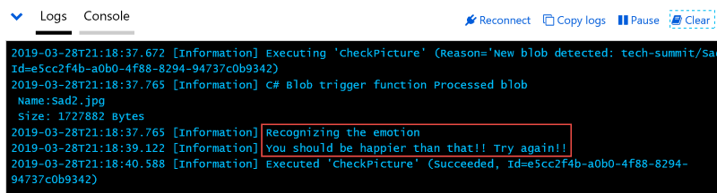

# Testing the application on Azure

In order to test the application, we will need you to show a big smile! Since we have already tested the Functions locally, what we are doing here is more of an integration test. We will use the logs in both Azure Functions to check if everything works as expected.

## Inspecting the logs for the Blob triggered Function

Many services on Azure allow you to inspect the logs during runtime. This is very useful to check the health of a service on the spot, as well as for debugging purposes.

> In this example we will work directly on the production application, but you can also use [deployment slots](TODO) with Azure Functions, which are very safe and convenient before you publish your application to production. 

1. Open the Blob triggered function in the Azure portal:

    1.1. Navigate to [http://portal.azure.com](http://portal.azure.com). 

    1.2. On the right hand side, select Functions from the Favorites list. 

     

    1.3. In the list, select the Functions application that you created earlier. 

    1.4. Under Functions, select the Blob triggered function named `CheckPicture` that you created earlier. 

     

    1.5. On the right hand side, you should see the Function's settings in JSON format. This is the so-called [`ARM template`](TODO) that VS Code created and deployed together with the compiled Functions code. 

    1.6. Right below the ARM template, click on the Logs tab. This will open the logs window below the ARM template. After a short moment you should see a message stating `Welcome, you are now connected to log-streaming service`. 

     

## Taking and uploading the "unhappy" picture

Now we are going to upload a picture and see the result in the logs. In order to concentrate on this Function only at first, and to make debugging easier, we will publish a picture that doesn't represent a person smiling. This way the Blob triggered Function will work, but the execution will stop there. 

1. Go to [the Azure Portal](http://portal.azure.com) in a new browser window and select Storage Accounts from the Favorites.

2. Select the Storage Account that you created earlier (the one that should be named `techsummiteastereggstore`).

3. Under `Blob service`, select `Blobs`.

4. Select the blob container you created earlier (the one named `tech-summit`).

5. Press the Upload button.

6. In the `Upload blob` drawer, select a file with a sad face from your computer and upload it.

7. Switch back to the browser window with the Blob triggered Function open, and observe the logs. After a short wait, you should see a message stating that `You should be happier than that!! Try again!!`.

This test is a success, because the Function was triggered properly, analyzed the picture and then stopped execution as it should. Now we can test the "happy" scenario.

## Opening the logs in the HTTP triggered Function, taking the "Happy" picture

Now that we made sure that the Blob triggered Function is running as expected, and that the cognitive service was called successfully, we can do the final test: Let's upload a Happy picture and see if everything works as expected. For this, we will use the logs in the HTTP triggered Function that you created earlier. This Function is called by our verification application, so that we can make sure that you followed the steps and published your application to Azure. 

1. Return to the Functions Application that we opened earlier and select the HTTP triggered function this time. 

 

2. Like we did before for the Blob trigged application, under the ARM template on the right hand side, select the Logs tab. 

3. After a short wait, you should see the message `Welcome, you are now connected to log-streaming service`.

4. Switch back to the Storage account browser window, and follow the steps again to upload a smiling picture.

5. Switch back to the HTTP Function window. After a short wait, you should see the following message: `C# HTTP trigger function processed a request`. This means that the verification application called the HTTP triggered Function to verify that your application is live on Azure. If you check the Blob triggered Function's logs, you should see a series of messages too such as `Success!! Check {resultUrl} for details.` where the `resultUrl` points to the `tech-summit-result` Blob container and the TXT file corresponding to the image you submitted.

> Note: It is possible that the Blob trigger doesn't react immediately, and takes a few seconds or even minutes before being activated. This is normal. Just be patient and wait until the logs start appearing.

> Note 2: Unfortunately it is also possible that the logs don't reflect the messages accurately. Don't worry too much if the log messages don't appear on time, you can always check the `tech-summit-result` Blob container for the result of the operation!

## Success? 

At this point, everything should have triggered properly. Since we submit the "success" tweet manually, please allow for a few hours for this to work. Make sure to check Twitter regularly so you can show off to your friends and colleagues!! 

## What do I do if this fails? 

We want to try to help you understand the code and be successful. If something doesn't work as expected, do not hesitate to contact [Laurent Bugnion](TODO) with as many details as possible. We will get back to you as soon as possible. 