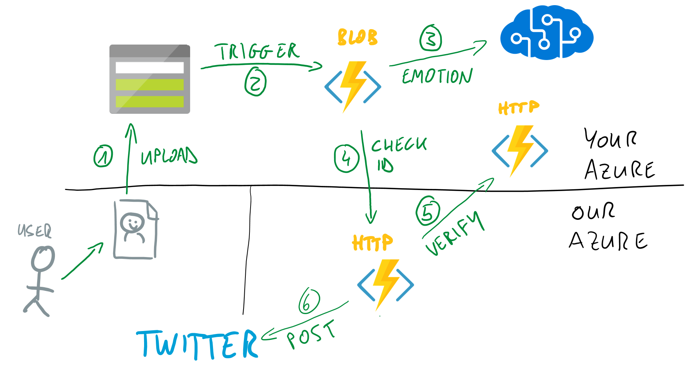

# Microsoft Switzerland TechSummit 2019 Easter Egg!

> Hello and Welcome to the Microsoft Tech Summit Switzerland’s Easter Egg.
 
Congratulations on finding the readme file on the floppy disk and dealing with antique technology. That's pretty impressive. Now for the really fun part!
 
Now you are going to have to switch eras to build an Azure application using the latest technologies: Azure Functions (Serverless code) and Cognitive Services (artificial intelligence). And what’s the prize at the end? If you succeed, we will tweet our congratulations from the Microsoft Switzerland’s Twitter account (with your permission of course). Public proof that you were able to navigate 30 years of tech to solve this challenge before the time ran out. 
 
We hope that you have a lot of fun building this app.  We can’t wait to get your submission and to tweet our congratulations!
 
Happy coding

Your Microsoft Switzerland Tech Summit team

## Application architecture

In this tutorial, we will create an application involving diverse services from Azure. We will create and configure all the services needed for this application to work, and code the serverless Azure Functions that will handle the work.

1. You will take a selfie with a big smile on your face. You will upload the picture to Blob storage using the Azure Web Portal's Storage Explorer.

> Note: You can also use the [Azure Storage Explorer](TODO) to upload the picture to the blob storage.

2. An Azure Function will be triggered by the Blob upload ([Blog triggered Function](TODO)). 

3. The Function will call a Cognitive Service using [the Face API](TODO) to analyze the image's emotion.

4. Once the emotion has been recognized as Happy, your Azure Function will call a verification application with some details about your application.

5. The verification application will call another Azure Function ([HTTP triggered function](TODO)) that you developed. This is used to verify that your application was indeed published to Azure.

The verification application checks the following criteria:

- Your application must be published on Azure, using a free account or a paid subscription.
- Your application can only submit successfully once to the verification application.

### Your reward

If you implement and publish this application successfully to Azure, and submit a smiling picture, we will publish a message of congratulation to Twitter from the Swiss Microsoft account. You will also get our well deserved admiration for finding the Easter Egg and following the instructions successfully :)

> We will only tweet the message of congratulation with your explicit consent.

### The ways to create and publish your application

We provide complete instructions to setup the Azure environment, implement the application and publish it to Azure.

You can also check the finished application [in this repo](TODO).

The Azure Functions application is implemented in C# using .NET Core 2.0.

1. [Setting up the Azure environment](./Doc/01-settingup.md).
2. [Installing the tools](./Doc/02-installing-tools.md).
3. [Implementing the Blob Triggered Function and testing it locally](./Doc/03a-blob-function.md).
4. [Implementing the HTTP Triggered Function and testing it locally](./Doc/03b-httpfunction.md)
5. [Publishing the application to Azure](./Doc/04-publishing.md).
6. [Testing the application](./Doc/05-testing.md).

Have fun and happy coding!!

Your Microsoft Switzerland Tech Summit team. 
